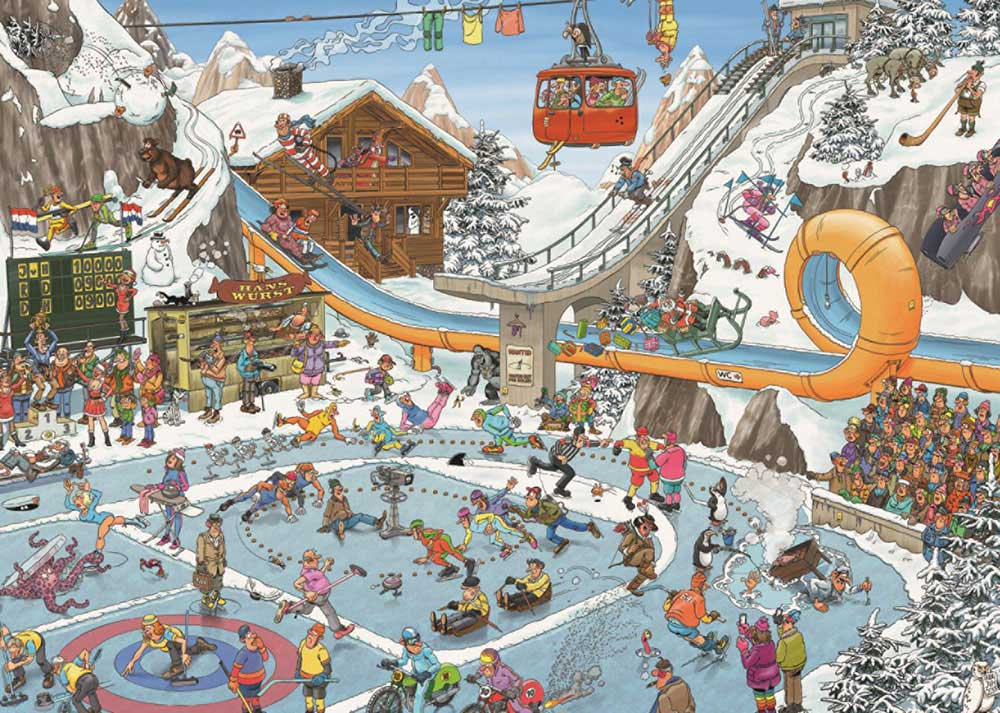

<style type="text/css">
.title {
  display: none;
}

#getting-started img {
  margin-right: 10px;
}

</style>

### Hello hello, wie hebben we daar? 




```{r setup, include=FALSE}
knitr::opts_chunk$set(echo = TRUE)
```

```{r ifchunk, echo =F}
date_today <- Sys.Date()
if(date_today == "2020-11-26") {
  print("yes") } else {
    print("Wait a little longer")
  }
```


```{r ifchunk_time, echo =F}
time_today <- Sys.time()
if(time_today == "2020-11-25 13:20:58 CET") {
  print("Yes, now's the time") } else {
    print("Wait a little longer")
  }
```
